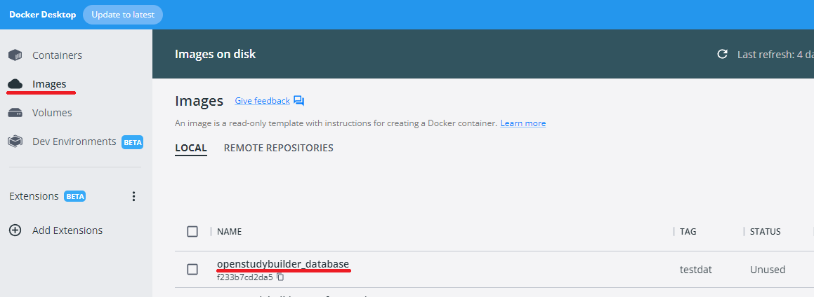
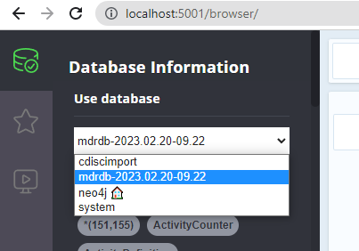

# Backups on Windows using docker environment

Backups are quite useful, so when you load new data or play around, you can go back to a previous stage. Container wise, all content is done in the "database" container, so having backups and restore options for this would be sufficient.

## DB Backup within docker

When we checkout the backup script (see below), we can see the backup creation is the following: `docker exec "$1" /var/lib/neo4j/bin/neo4j-admin backup --backup-dir=/db_export --database="$2"`. This we can modify with the corresponding parameter values and can execute in the windows command line console after create the export folder on docker.

```
docker exec "database" mkdir db_export
docker exec "database" /var/lib/neo4j/bin/neo4j-admin backup --backup-dir=./db_export --database="mdrdb-2023.02.20-09.22"
```

The corresponding import contains quite some commands which can then be executed step by step. You can see them in the import_db_backup.sh script ([here](https://gitlab.com/Novo-Nordisk/nn-public/openstudybuilder/OpenStudyBuilder-Solution/-/blob/main/neo4j-mdr-db/import_db_backup.sh)).


## Docker image backup

We can create an image from a docker container which we can use as backup. Please see the [docker documentation](https://docs.docker.com/engine/reference/commandline/commit/) for support.

To backup the database container we can use the following command in the command line terminal:

```
docker commit database openstudybuilder_database:testdat
```

You can see this backup within Docker Desktop via images -> Local.



To save this image as a compressed single file, you can use the following command:

```
docker save openstudybuilder_database:testdat > c:/backup/openstudybuilder_database_testdat.tar
```

To restore that image into the docker image store, you can execute the following command:

```
docker image load -i c:/backup/openstudybuilder_database_testdat.tar
```

**TODO**: document docker restore comments (docker create, start)

****************************


## DB Backup Script (NOT WORKING)

There is a backup script available for the database ([see here](https://gitlab.com/Novo-Nordisk/nn-public/openstudybuilder/OpenStudyBuilder-Solution/-/tree/main/neo4j-mdr-db#exporting-a-database-backup)). Open the console and go to the corresponding location:

```
cd c:\myInstallLocation
cd neo4j-mdr-db
```

First we need to figure out how or backups are named. You can open the neo4j browser [http://localhost:5001/browser/](http://localhost:5001/browser/) and see which databases are available on the top left clicking the database icon and then select the arrow.



The database name containing everything for the OpenStudyBuilder is for my installation (v0.3-docker environment): mdrdb-2023.02.20-09.22.

Furthermore we need to create the .env file containing basic information. Assuming no changes for the docker installation and using the defaults, the .env file can created with the following content:

```
NEO4J_MDR_HTTP_PORT=5001
NEO4J_MDR_BOLT_PORT=5002
NEO4J_MDR_HTTPS_PORT=5001
NEO4J_MDR_HOST=localhost
NEO4J_MDR_AUTH_USER=neo4j
NEO4J_MDR_AUTH_PASSWORD=changeme1234
NEO4J_MDR_DATABASE=neo4j
NEO4J_MDR_CLEAR_DATABASE=false
NEO4J_MDR_BACKUP_DATABASE=false
```

### Using windows command line with script

**NOT WORKING**

The next step is to create environment variables. When you are in the linux environment, you can use the proposed command `export $(grep -v '^#' .env | xargs)`. You can set environment variables in windows using the "SET" command. So within the command line, you can execute:

```cmd
SET NEO4J_MDR_HTTP_PORT=5001
SET NEO4J_MDR_BOLT_PORT=5002
SET NEO4J_MDR_HTTPS_PORT=5001
SET NEO4J_MDR_HOST=localhost
SET NEO4J_MDR_AUTH_USER=neo4j
SET NEO4J_MDR_AUTH_PASSWORD=changeme1234
SET NEO4J_MDR_DATABASE=neo4j
SET NEO4J_MDR_CLEAR_DATABASE=false
SET NEO4J_MDR_BACKUP_DATABASE=false
```

Finally we can use the backup script. The first parameter is the name of the docker container and the second parameter is the name of the database.

```
export_db_backup.sh database mdrdb-2023.02.20-09.22 backup_mdrdb.tar.gz
```

### Using windows bash with script

**ALSO NOT WORKING**

The scripts should run within a bash. For this change to the bash concole:
```
bash
```

Now we need to create the environment variables, this we can do as documented with `export $(grep -v '^#' .env | xargs)`.

Finally we can use the backup script. The first parameter is the name of the docker container and the second parameter is the name of the database.

```
bash ./export_db_backup.sh database mdrdb-2023.02.20-09.22 backup_mdrdb.tar.gz
```

This is not working, because docker is not available on the bash per default. To enable this. you might follow the instrucutions here:
https://blog.jayway.com/2017/04/19/running-docker-on-bash-on-windows/. 

### Using the direct command

When we checkout the script, we can see the backup creation script is the following: `docker exec "$1" /var/lib/neo4j/bin/neo4j-admin backup --backup-dir=/db_export --database="$2"`. This we can modify with the corresponding parameter values and can execute in the windows command line console.

```
docker exec "database" mkdir db_export
docker exec "database" /var/lib/neo4j/bin/neo4j-admin backup --backup-dir=./db_export --database="mdrdb-2023.02.20-09.22"
```