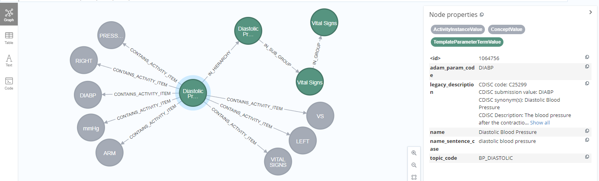

# Browse the Database

This has been developed using OpenStudyBuilder 0.5 - due to changes activity browsing is not working this way in 0.6. An update is expected somewhen.

## Start the DB browser

You can browse the Neo4j database with the browswer using for the sandbox for exampla the following URL: https://openstudybuilder.northeurope.cloudapp.azure.com/browser/. When running the local installation, you have to checkout the port where the database is running, this could for example be: http://localhost:5001/browser/.

In the Sandbox environment you need to select the "Single Sign On" type to login with Azure SSO. In the local host you need to enter the database user and password - if you have not changed the defaults it will be "neo4j" and "changeme1234".

Then you can enter any cypher comments. As we want to browse the database, we will use `MATCH` statement. But first of all, we need to select the correct database. In the sandbox, the default database is "neo4j" which does not contain any data. The database for our OpenStudyBuilder is named "mdrdb[date]". You can connect to this DB with the left database icon and through the dropdown menu.


To see if we selected the right database and to check that there is something in, we can use a very generic query to get some connected nodes.

```cypher
MATCH (n1)-[r]->(n2) RETURN r, n1, n2 LIMIT 25
```

## Browse Activities

To get a brief impression about the activities, we can investigate some with the following command:

```cypher
MATCH (n2:ActivityGroupValue)<-[]-(n4:ActivitySubGroupValue)
      <-[]-(n6:ActivityValue)<-[]-(n8:ActivityInstanceValue)
      -[]->(n10:ActivityItemValue) 
      RETURN n2, n4, n6, n8, n10 LIMIT 15
```


In the OpenStudyBuilder there is a "Diastolic Blood Pressure". 


Let us know look into the graph for this activity instance:

```cypher
MATCH (n2:ActivityGroupValue)<-[]-(n4:ActivitySubGroupValue)
      <-[]-(n6:ActivityValue)<-[]-(n8:ActivityInstanceValue)
      -[]->(n10:ActivityItemValue) 
      WHERE n6.name = 'Diastolic Blood Pressure'
      RETURN n2, n4, n6, n8, n10 
```



This way we can continue. For example we could look at all connections for the "ActivityInstanceValue" of "Diastolic Blood Pressure":

```cypher
MATCH (n1:ActivityInstanceValue)-[r]-(n)
      WHERE n1.name = 'Diastolic Blood Pressure'
      RETURN n1, n
```

This way you can browse the database and it's content.


## Learning material for Cypher

- https://neo4j.com/developer/cypher/


## Learning material for Neo4j Dashboards

- https://neo4j.com/labs/neodash/#_videos_tutorials
