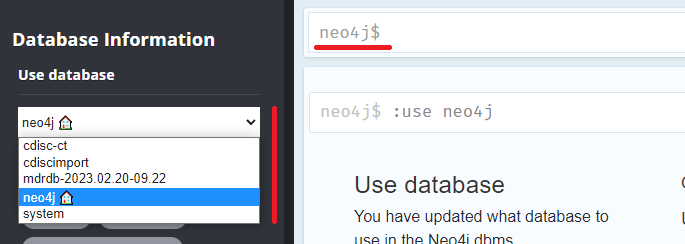
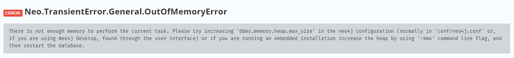
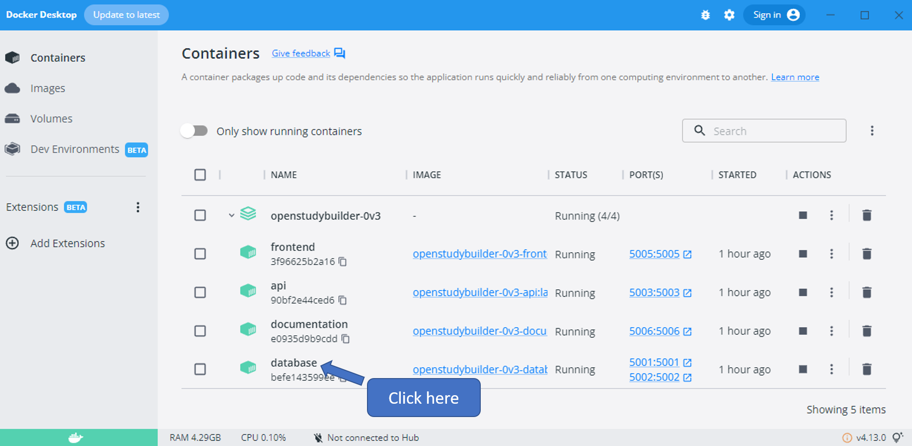

# Setup CDISC Controlled Terminology

The initial data does contain a few CDISC CTs, but not all. To load also other CTs, there scripts are available in the "mdr-standards-import" part of the repository (see [here](https://gitlab.com/Novo-Nordisk/nn-public/openstudybuilder/OpenStudyBuilder-Solution/-/tree/main/mdr-standards-import)). These scripts are not using the API, but are working directly with the **database connection**. 

## Preparations

To be able to use the CDISC Library API, you need to create an account and get an authentication token for this. You can register or log into the library here: https://library.cdisc.org/browser. In the CDISC Library browser, go to settings (top-right), then "API Portal". Under "API Key", the primary key is shown and can be copied.

Additionally create the folder "cdisc_data/packages" to store the CDISC library download intermediately. Please note the port numbers - when docker is used these are 5001 (HTTP) and 5002 (BOLT) and the default password is "changeme1234". Please note as well that you have to provide the full absolute path as parameter in the download call.

As in the explanation, we need to run `pipenv install` to setup the environment and install all required packages. We also need to create the folder. "cdisc_data/packages" to store the CDISC library download intermediately.

```
cd <path>/mdr-standards-import
pipenv install
mkdir cdisc_data\packages
```

Finally we also need to create the .env file - by using the docker environment, we have to use 5002 (BOLT) as port numbers and the default password of "changeme1234". Also include your personal library token (`<<Insert secret here>>`) and the concrete path (`<path>`). Please note that you have to provide the full absolute path as parameter in the download call. You also need to use the correct library name where the OpenStudyBuilder data is stored in. The database for version 0.3 is named "mdrdb-2023.02.20-09.22". To test the import, you might want to load it to "NEO4J_MDR_DATABASE=neo4j" first.

.env file:

```
#
# Neo4j Database
#
NEO4J_MDR_BOLT_PORT=5002
NEO4J_MDR_HOST=localhost
NEO4J_MDR_AUTH_USER=neo4j
NEO4J_MDR_AUTH_PASSWORD=changeme1234
NEO4J_MDR_DATABASE=mdrdb-2023.02.20-09.22

NEO4J_CDISC_IMPORT_BOLT_PORT=5002
NEO4J_CDISC_IMPORT_HOST=localhost
NEO4J_CDISC_IMPORT_AUTH_USER=neo4j
NEO4J_CDISC_IMPORT_AUTH_PASSWORD=changeme1234
NEO4J_CDISC_IMPORT_DATABASE=cdisc-ct

#
# CDISC API
# API token is not mandatory as the package
# folder is now placed in the repository
#
CDISC_BASE_URL="https://library.cdisc.org/api"
CDISC_AUTH_TOKEN="<<Insert secret here>>"

#
# Download folder for the CDISC JSON package files
#
CDISC_DATA_DIR=

```

## Download CTs from the CDISC Library

Now we can download the CTs from the library using the following command in our console:

```
pipenv run python -m mdr_standards_import.cdisc_ct.dev_scripts.download_json_data_from_cdisc_api cdisc_data\packages
```

## Load CTs in to database

I recommend a backup before performing any steps, see [here](./Backups.md) my experiences.

We can see all related JSON files in our subfolder cdisc_data/packages. To omit version you do not need at all, you might want to move unneeded files into a subfolder. The next step is do import the CTs into a CT database and then into the MDR database (this one holds all OpenStudyBuilder data). That might take a while.

```
pipenv run python -m mdr_standards_import.cdisc_ct.dev_scripts.bulk_import 'TEST' cdisc_data\packages true
```

**hint** When loading too many standards, I got an out of memory issue on my local installation. I recommend to load only very few files - probably just one for initial testing.

## Out of memory Issue

During the script run, I received an out of memory issue. For this I aborted and restarted the import. This resulted in the script hanging at one point. To restart freshly, I remove the intermediate database (http://localhost:5001/browser/):

```
DROP DATABASE `cdisc-ct` IF EXISTS
```

I had been installing the codelists on the database "neo4j" which is not the database used by the OpenStudyBuilder. To reset everything, I want to delete all nodes from that database. Make sure the right database is selected (neo4j) and then you can enter the delete everything command.



```
MATCH (n)
DETACH DELETE n
```



Unluckily I received another "out of memory" issue. When I try to delete the relationships only, that already also causes the same issue. The error message proposes to increase the heap size, so let's do so.

### Increase heap size (fail)

**DO NOT DO, this might destroy your docker image**

First we need to start the terminal of the docker container. I am user Docker Desktop where I can see all my containers running and can click on the database container. At the top there are various areas - also one for terminal. When clicking this, you are in the terminal and can execute commands.



Let's first look where we are with `ls`. As indicated in the error message, the configuration is likely in conf/neo4j.conf. We see that conf is available, so we switch to that folder `cd conf` and then list the content of that again `ls`. To see the content of the file, we can use the command `cat neo4j.conf`. There is quite some information available and at the bottom also the options. Before we modify the file, it is a good idea to create a copy: `cp neo4j.conf neo4j.back`.

I want to replace the "dbms.memory.heap.max_size=500m" with 1000m. Unluckily there is no editor installed in this environment. Luckily there is also simple command which can be used `sed -i "s|dbms.memory.heap.max_size=500m|dbms.memory.heap.max_size=1000m |g" neo4j.conf`. Let's look into the file via `cat neo4j.conf`, that the change is available as expected.

Now we need to restart the docker container. For this go back to the container overview and click stop and start.

The container no longer starts - for this also the file cannot be edited back. That had been a bad idea - delete all containers starting with the installation from blank.

