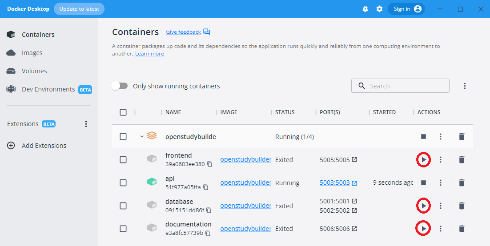

# Installation Experiences

The following experiences are based on OpenStudyBuilder v0.6.1 Details instructions and hints are available on the projects [readme file](https://gitlab.com/Novo-Nordisk/nn-public/openstudybuilder/OpenStudyBuilder-Solution/-/blob/main/README.md).

## System & pre-requisites 

I am using a Windows 10 system having Docker, php and composer and many other things installed. Also WSL had to be installed. Please checkout the [software dependencies](https://gitlab.com/Novo-Nordisk/nn-public/openstudybuilder/OpenStudyBuilder-Solution#software-dependencies) in the OpenStudyBuilder readme.

I need to remove old instances using the same names/ports from docker to install a new one (start docker, select the outdaten OpenStudyBuilder, delete). In case you get an issue `error during connect: this error may indicate that the docker daemon is not running:` - start Docker Desktop application so the daemon is starting in the background.

When you already have installed the OpenStudyBuilder in an old version and want to install the new version, then you have to remove all old images and volumes additionally to the old containers related to the OpenStudyBuilder. Otherwise the installation or startup might fail.

## Install Solution

Open the command line and download + install via docker with the following steps in the console:

- change to your install location
- clone the repository (in the example I gave it a different name)
- change into that repository
- run the docker compose

```
cd c:\myInstallLocation
git clone https://gitlab.com/Novo-Nordisk/nn-public/openstudybuilder/OpenStudyBuilder-Solution.git OpenStudyBuilder-0.4
cd OpenStudyBuilder-0.4
docker compose up -d --build
```

In case of issues, remove old installations (will **remove ALL** docker images):

```shell
docker compose build --no-cache                # rebuilds the docker images
docker compose down --remove-orphans --volumes # DESTROYS THE DATABASE volume 
docker compose up -d                           # the database service re-creates the database volume on the first start 
```

If this does not help, make sure to also remove all old images, as the newest "latest" might not be loaded otherwise.

To check that the application is up and running you can start it [http://localhost:5005/](http://localhost:5005/). The version 0.4 is already loaded with test data which is very nice.

## Restart Docker

In windows I do not have the docker deamon up and running immediately. To start the docker environment, I use "Docker Desktop". For some reasons the contains (specifically teh database container) is not starting up, but after multiple retries, it is always working. You can manually click "play" for the components - the database must be running for the API and the Frontend to run:



## Rebuild containers after updates

In case you want to change something and reload the containers, you can do the following:

```
docker compose build --no-cache api
docker-compose up --force-recreate api
```
