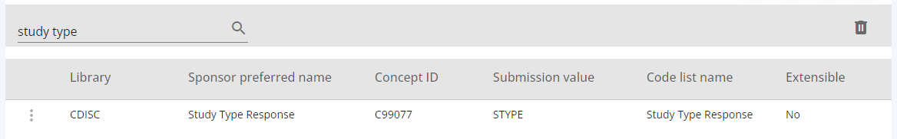
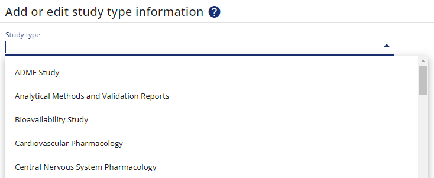

# Local Application Updates

To checkout and play around with the local OpenStudyApplication app, we can compile the solution with yarn. It's written using the vue.js framework.

## Setup & Background

I am working with Windows having installed everything as dockerized containers. I start all the containers (including the installed application) to have the database, API and everything running on http://localhost:500*, e.g. http://localhost:5005/ the app itself.

Start the command line and go to the application directory `./studybuilder`. I update the config (`<path>\studybuilder\public\config.json`) to use the full path which defines the API: change `"API_BASE_URL": "/api",` to `"API_BASE_URL": "http://localhost:5005/api",`. Then install all dependencies and start the application for development.

```
cd <path>\studybuilder
yarn install
yarn serve
```

To start the development next time, you only need to use the `yarn serve` command.

Now you should be able to start the running development instance via: [http://localhost:8080/](http://localhost:8080/). In your browser you can check within the development tools via "network" that the API requests are also processed as expected and you do not receive errors there. 

## Example - How to change "study type" selections?

### Codelist "Study Type Response"

As an example we want to figure out where the selection for "Study type" is coming from to be able to add additional study types. When you selected a study (e.g. CDISC DEV-0), you can to to "Studies" -> "Define Study" -> "Study Properties" -> click the edit button.

We do see in the GUI the term "Study type" displayed. To get the location in the source code, we can search for this tearm in the "src" directory. We find this in the "en.json" file. This is a localization file. Instead of having hard coded labels, these labels are assigned to variables which are used. This enables to use for example a french file later on using french language. We can see the "key" for this label is `studytype`. Next we search that term. This is found in various files. One of this is called "StudyDefineForm" which sounds like the form we are looking at.

When we look into the code, the form is defined by different attributes. One is called `items` which sounds like what we want to look at. The content is called `studyTypes`, so this is the selection available for that form. But where does this come from? When searching for "studyTypes" - there are also only a few places where this is used. When looking into the files, this information is coming from the "store" (store\modules\studies) - to get the study types, a `"terms.getByCodelist('studyType')"` is called.

Nearly everything is defined by standards and controlled terminology as everything is linked. This is great, as we cannot enter a study type which is not available according our standards. But let us follow the way along. The `terms` are coming from `import terms from '@/api/controlledTerminology/terms'` and in there just in the beginning you can see that the related codelist UID is C99077: `studyType: { attribute: 'codelist_uid', value: 'C99077' }`. 

We can browse this codelist in our library. So within the app we can go to "Library" -> "CT Catalogues" -> search for C99077. Here we find the CDISC Codelist "Study Type Response". Clicking the three dots, we can "show terms" to see the fours options we also have in our dropdown. Theoretically we might want to add new types here. But this is a CDISC CT codelist which is not extensible. For this it is not possible to update this list.



### Codelist "SEND Study Type"

Finally, we might want to use a different study type. For our case we wanted to edit the "Study Type" as we want to showcase the OpenStudyBuilder for pre-clinical studies. Here we do not use the "Protocol CT" from CDISC, but the "SEND CT". There is a codelist calles "SEND Study Type" which we want to utilize. This is also extensible, meaning we could add additional terms if the SEND ones are not sufficient.

When we browse the library for "SEND Study Type" we can see the "Concept ID" value of "C90003". Now we change the studyType definition to use this codelist instead.

In "studybuilder/src/api/controlledTerminology/terms.js" we exchange `studyType: { attribute: 'codelist_uid', value: 'C99077' }` with `studyType: { attribute: 'codelist_uid', value: 'C90003' }`.

Now within the application, the SEND codelist is used. So when we select a study, go to "Project Properties" and click the "edit" button, you can see the following list:



