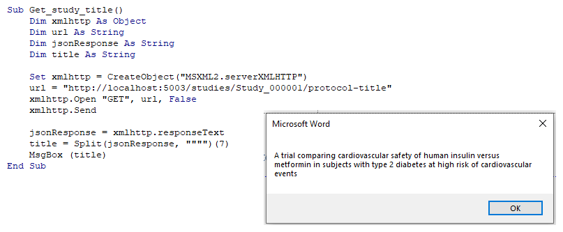

# Protocol automation

A main advantage for the OpenStudyBuilder usage is the opportunity to automate downstream systems and tools. To support connectivity and downstream usage, the API provides a standard interface to the data. One use case is the protocol automation. The OpenStudyBuilder project has shown that the protocol automation is working - they do have a Word-Addin which is unluckily not available as open-source. But to get an idea of the functionality, please checkout the [video](https://novo-nordisk.gitlab.io/nn-public/openstudybuilder/project-description/info_ddf/#integration-to-protocol-and-sdtm-study-design-data) for the procol automation.

There are various ways how the protocol could be automated. I would assume that Word is the prefered format at least for the first automation prototypes. 

## VBA utilization

An obvious solution would be to utilize VBA. I would not recommend VBA, as this required an active Word instance to run and is programmatically also not the most modern choice of programming language. On the other side VBA is designed to work with those documents and you can do anything you need.

With VBA you can easily search and replace text and do much more. The question is how to get the data for your study. And this is done through the API. The following example shows to get the study title. Information of the protocol-title are read in as JSON format. Unluckily there is no in-build JSON library available for VBA. But you could search and download a package. For demonstration purposes, we just extract the title from the JSON reponse via a text split.

```
Sub Get_study_title()
    Dim xmlhttp As Object
    Dim url As String
    Dim jsonResponse As String
    Dim title As String
    
    Set xmlhttp = CreateObject("MSXML2.serverXMLHTTP")
    url = "http://localhost:5003/studies/Study_000001/protocol-title"
    xmlhttp.Open "GET", url, False
    xmlhttp.Send
    
    jsonResponse = xmlhttp.responseText
    title = Split(jsonResponse, """")(7)
    MsgBox (title)
End Sub
```



## R utilization (officier)

https://davidgohel.github.io/officer/

## Python utilization (python-docx)

https://stackoverflow.com/questions/24805671/how-to-use-python-docx-to-replace-text-in-a-word-document-and-save

## Python utilization (docxtpl)

https://pypi.org/project/docxtpl/